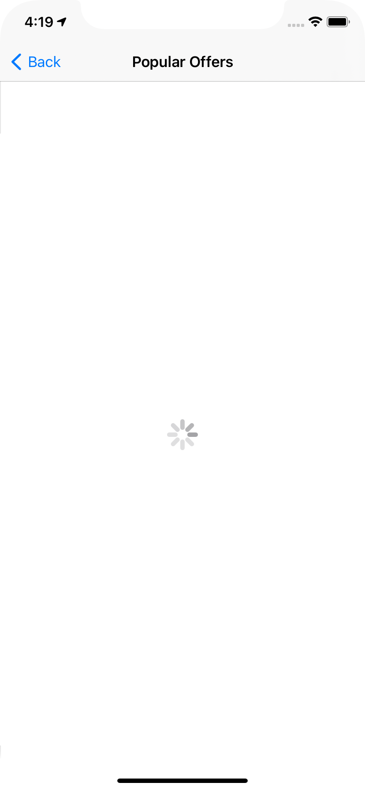
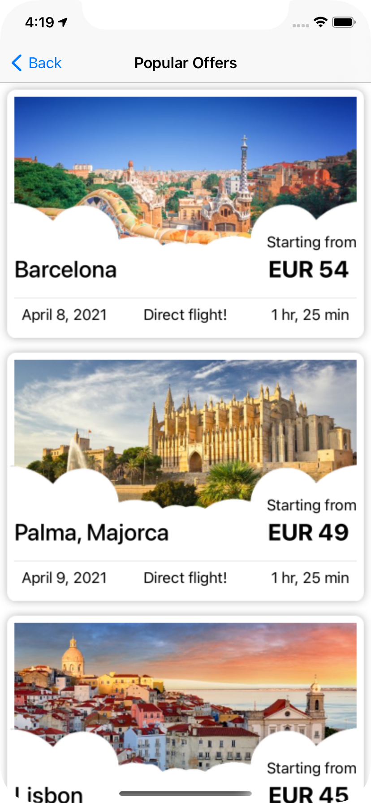
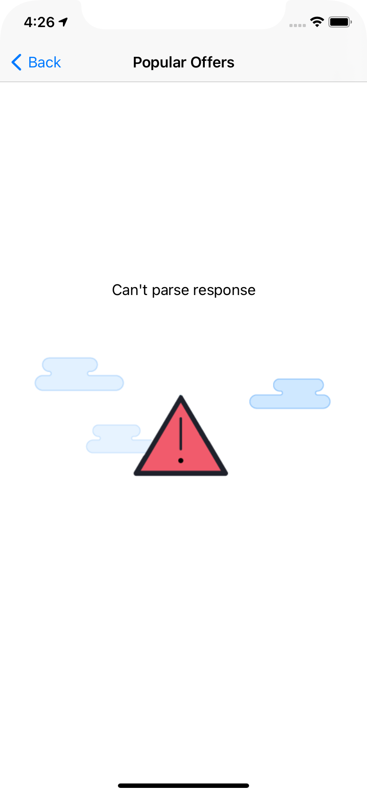
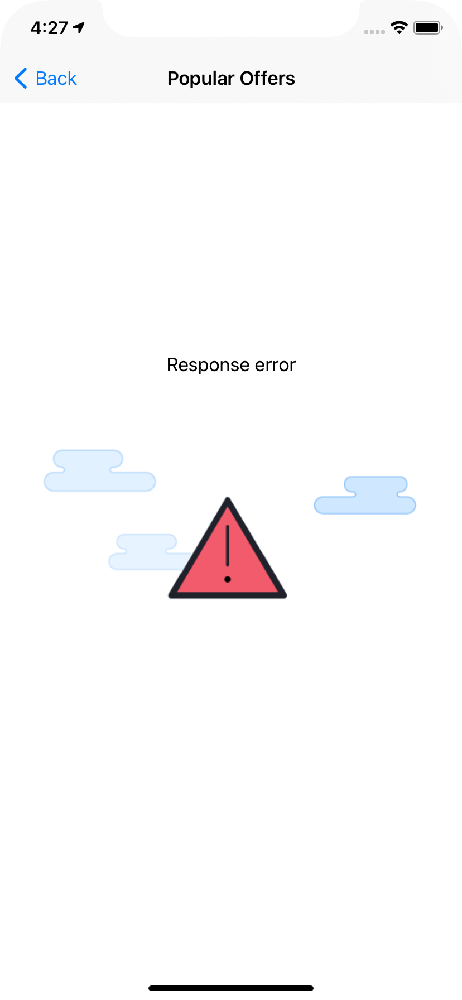
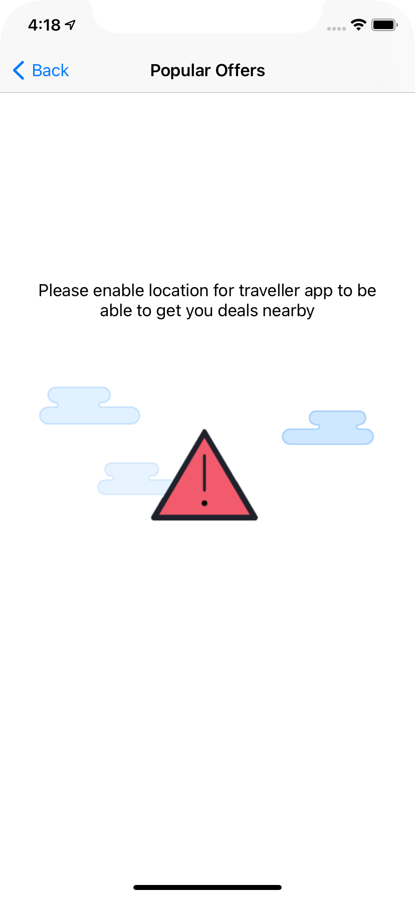
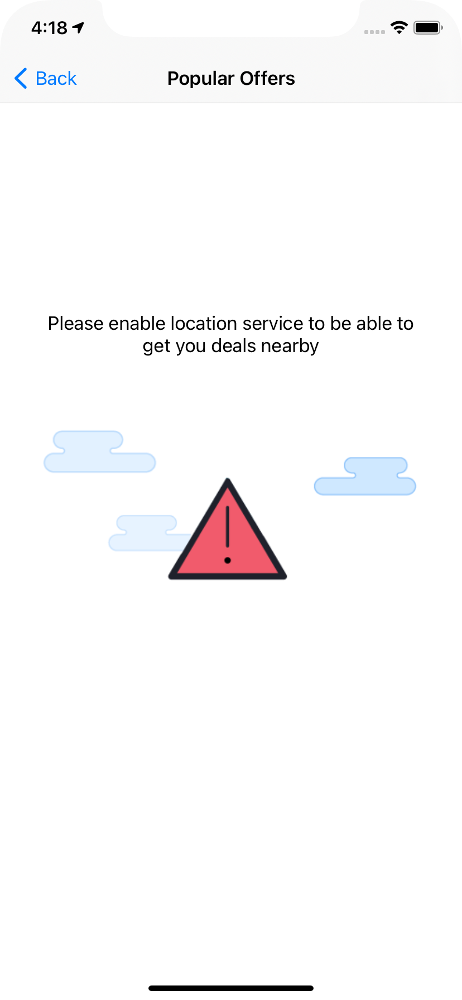
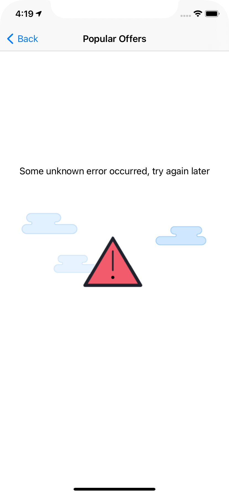
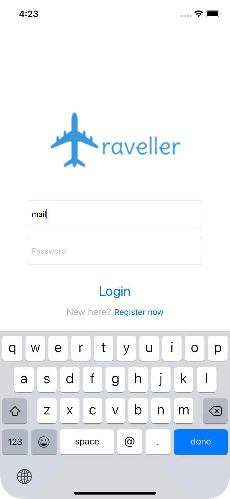

## Traveller app
shows you the popular flight offers to different destinations using Kiwi API 

### Project specs
- Xcode version 12.4
- Cocoapods version 1.10.1

### Dependincies 
- Alamofire version 5.2, [Github](https://github.com/Alamofire/Alamofire)
- AlamofireImage version 4.1, [Github](https://github.com/Alamofire/AlamofireImage)

### Running the app
- Clone the repo
- Run `pod install` inside the repo folder
- Run `Traveller.xcworkspace` 

### API configuration
- First I was using skypicker api but I notced that the docs says we highly recommend using tequila.kiwi.com
- So I have upgraded the network layer to use tequila.kiwi.com

### Implementation plan
you can find more about what is currently implemented and what could be added if we had more time, [here](https://docs.google.com/spreadsheets/d/1HHcXiZNlajEqxF_5usyq5EthRvCbp3eelU0DdiMvibQ/edit?usp=sharing)

### API key
- You will need to create an account in Tequila portal [here](https://tequila.kiwi.com/portal/login/register)
- Then you need to create a solution [here](https://tequila.kiwi.com/portal/my-solutions)
- After visiting that solution you just created, in the `Details` section you would find the API key to use
- you will need to create a Config file nammed `Config.xcconfig` in Traveller/Commons/Config.xcconfig
- And add your API key in that file `API_KEY = xxx`
- this file is local and won't be stored in the git repo, ignored in the `.gitignore` file

### Screenshots
#### Popular flights flow

  
  
  
  

#### Popular flights screen different states
##### Loading

##### Normal flights loaded

##### Empty flights response

##### API errors

    
    
    

##### Location errors

    
    
    

#### Auth flow [not implemented just UI]

    
    
    

